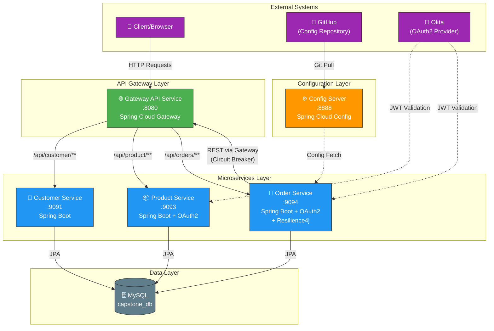

# Microservices Capstone Architecture

## Service Details

| Service | Port | Technology | Description |
|---------|------|------------|-------------|
| **Config Server** | 8888 | Spring Cloud Config | Externalized configuration from GitHub |
| **Gateway API** | 8080 | Spring Cloud Gateway | API routing & load balancing |
| **Customer Service** | 9091 | Spring Boot + JPA | Customer CRUD operations |
| **Product Service** | 9093 | Spring Boot + OAuth2 | Product management with JWT security |
| **Order Service** | 9094 | Spring Boot + OAuth2 + Resilience4j | Order processing with fault tolerance |

## Key Patterns & Technologies

### 1. API Gateway Pattern
- Single entry point for all client requests
- Route-based forwarding to microservices
- Path predicates: `/api/customer/**`, `/api/product/**`

### 2. Externalized Configuration
- Config Server pulls from GitHub repository
- Order Service imports config: `configserver:http://localhost:8888`
- Profile-based configs: `local`, `prod`

### 3. Security (OAuth2/JWT)
- Okta as OAuth2 provider
- JWT token validation on Product & Order services
- Resource server configuration

### 4. Resilience Patterns (Order Service)
- **Circuit Breaker**: `productService` instance
  - Sliding window: 10 calls
  - Failure threshold: 50%
  - Wait in open state: 30s
- **Retry**: 3 attempts with exponential backoff

### 5. Inter-Service Communication
- Order Service → Gateway → Customer/Product Services
- REST clients with OAuth2 token propagation

## Data Flow

1. **Client Request**: Client sends request to Gateway (:8080)
2. **Routing**: Gateway routes to appropriate service based on path
3. **Authentication**: JWT validated against Okta
4. **Processing**: Service processes request, may call other services
5. **Database**: JPA persistence to MySQL `capstone_db`
6. **Response**: Response flows back through Gateway to client
