# Database Schema Diagram - Microservices Capstone

```mermaid
erDiagram
    CUSTOMER {
        Long customerId PK
        String name
        String email
        int zipcode
    }
    
    ORDER_TABLE {
        Long orderId PK
        Date date
        Double totalValue
        Long customerId FK
    }
    
    PRODUCT {
        Long productId PK
        String name
        String description
        Double price
        Integer quantityAvailable
    }
    
    ORDER_TABLE_PRODUCTS {
        Long order_table_order_id FK
        Long products_product_id FK
    }
    
    CUSTOMER ||--o{ ORDER_TABLE : "has many"
    ORDER_TABLE ||--|{ ORDER_TABLE_PRODUCTS : "contains"
    PRODUCT ||--|{ ORDER_TABLE_PRODUCTS : "included in"
```

## Relationships

| Relationship | Type | Description |
|-------------|------|-------------|
| Customer → OrderTable | One-to-Many | A customer can place many orders |
| OrderTable ↔ Product | Many-to-Many | An order can contain multiple products; a product can be in multiple orders |

## Notes

- `ORDER_TABLE_PRODUCTS` is a JPA auto-generated join table for the Many-to-Many relationship
- `customerId` in `ORDER_TABLE` is a foreign key referencing `CUSTOMER`
- The owning side of the Customer-Order relationship is `OrderTable` (has `@JoinColumn`)
- The owning side of the Order-Product relationship is `OrderTable` (has the `@ManyToMany` without `mappedBy`)
